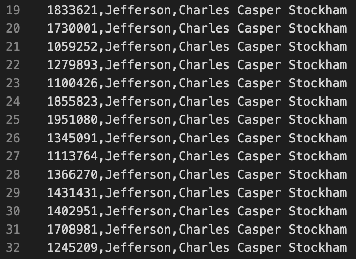
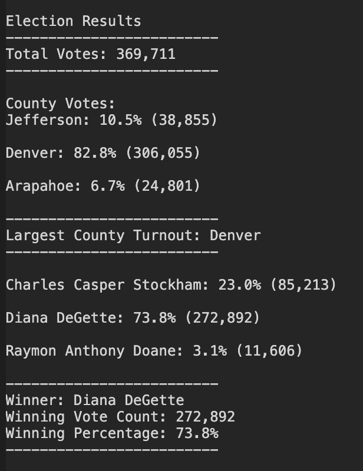

# Election Analysis
An analysis of election data with Python 3

## Project & Challenge Overview
In this exercise a Colorado Board of Elections employee requested an election audit of a recent local congressional election. The raw data was provided as a CSV (comma separated values) file, consisting of a list of unique ballot IDs, the counties in which the votes were cast, and the names of the candidates for who the votes were cast.

Our job was to take the information provided and perform the following tasks:
- Calculate the total number of votes cast in the election.
- Analyze data about the candidates, including:
    - building a complete list of candidates who received votes;
    - calculate the number of votes for each candidate, and their percentage of total votes cast;
    - determine the winner of the election based on popular vote;
- Analyze data about the counties, including:
    - building a complete list of counties in which votes were cast;
    - calculate the number of votes cast in each county, and their percentage of total votes cast;
    - determine which county had the largest voter turnout.

Once all this information was calculated, it needed to be output to both the terminal and saved to a text file.

## Resources
- Data Source: election_results.csv
- Software: Python 3.9.0, Visual Studio Code 1.51.1

## Audit Results
The analysis of the election data showed the following information:

As indicated in the screenshot shown above, of the results printed to the terminal:
- There were 369,711 votes cast in the election.
- The county turnout numbers were:
    - Denver had the most voters, with 82.8% of total turnout, at 306,055 votes.
    - Jefferson had the second-most voters, with 10.5% of turnout, at 38,855 votes.
    - Arapahoe had the least voters, with 6.7% of turnout, at 24,801 votes.
- The candidate results were:
    - Charles Casper Stockham received 23.0% of the vote, at 85,213 votes.
    - Diana DeGette received 73.8% of the vote, at 272,892 votes.
    - Raymon Anthony Doane received 3.1% of the vote, at 11,606 votes.
- The winner of the election was:
    - Diana DeGette

## Challenge Summary

